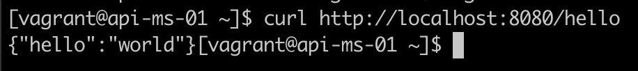
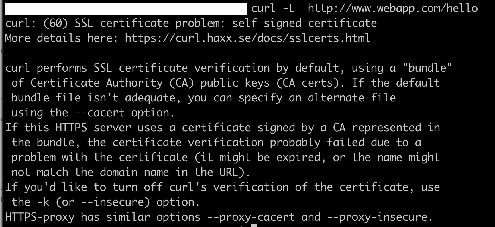
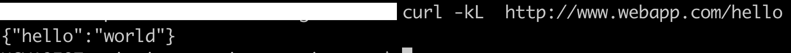
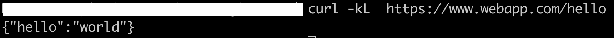

# API microservice

The following project deploys from Vagrant, a NGINX server ready for running a PHP application. The NGINX server is working in two ways:

 - As a reverse proxy, proxying [https://172.22.0.100/hello](https://172.22.0.100/hello) (frontend) to [http://localhost:8080/hello](http://localhost:8080/hello) (backend).

 - As a web server running a PHP application on http://localhost:8080/hello

All the HTTP requests are being redirected to HTTPS, and the certificates are being created by Puppet (self-signed). If a not self-signed certificate wants to be used, it can be changed in api-ms-01.yaml file:

- Define the directory where the certificate and key will be saved here (line 6):

 ```webapp::certs_dir: &certs_dir "/your/path/to/certs"```

- Save the certificate as <kbd>webapp.crt</kbd>
- Save the key as <kbd>webapp.crt</kbd>

## Getting Started

Before deploying the server, take into account the local environment specifications.

### Local environment
- MacOS Mojave 10.14.6
- Vagrant 2.2.7
- Virtualbox 6.1.16 r140961 (Qt5.6.3)

### Software stack deployed
- NGINX nginx/1.18.0
- PHP 7.2
- Openssl 1.0.2
- Puppet 4.10.12

### Facters

Only the fact <kbd>ipaddress_eth1</kbd> is being used in order to fix the frontend vhost IP.  It's a mandatory requirement to have the NAT interface on a VM for Vagrant manages it (eth0), so an extra NIC is added in Host-only adapter mode (eth1), so the Frontend URL is running over eth1 interface.

If the IP should be changed, it must be done in the Vagrant file, line 14. Default IP: 172.22.0.100.

### Installation

The installation is really simple though it can take about 10 min. because the provisioners are installing software and updating the OS. Running a single command, the webserver will be deployed:

```vagrant up```

"vagrant up" is creating the VM, running shell provisioners for installing the initial software needed (puppet, ruby, and ruby gems), and finally runs the custom Webapp module for configuring NGINX.

Additionally, if the following entry is created in the /etc/hosts file where the code is tried, the application could be accessed by DNS:

```172.22.0.100 www.webapp.com webapp.com```

## The Demo!

Check in the following screenshots, how the deployment worked successfully:

### Backend endpoint

- Connect to the backend vhost and get the JSON repsonse as expected:



### HTTP to HTTPS redirection

- From a web rowser the URL is directly redirected, however from CLI, it shows better when an HTTP request is complaining about an insecure certificate (it's a self-signed certificate):

<br/>

- So, adding -k option, the error can be skipped and the JSON response is gotten:

<br/>

### HTTPS Frontend

- Connect to the frontend vhost and get the JSON repsonse as expected:

<br/><br/>

## Webgraphy

- [https://forge.puppet.com/](https://forge.puppet.com/)
- [https://forge.puppet.com/modules/puppet/nginx](https://forge.puppet.com/modules/puppet/nginx)
- [https://forge.puppet.com/modules/puppet/php](https://forge.puppet.com/modules/puppet/php)
